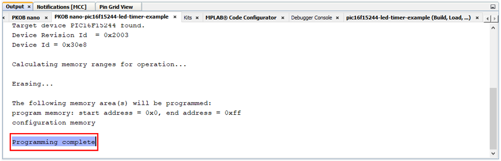

<!-- Please do not change this html logo with link -->

# Toggle an LED using Timer1 with PIC16F15244

The 'pic16f15244-led-timer-example' code example uses the PIC16F15244 Curiosity Nano Development board to demonstrate how to toggle LED0 every one second using Timer1 to configure the one-second time period.

##### PIC16F15244 Curiosity Nano Development Board:

## Related Documentation
- [PIC16F15244 Product Page](https://www.microchip.com/wwwproducts/en/PIC16F15244)

## Software Used
- MPLAB® X IDE 5.40 or newer [(microchip.com/mplab/mplab-x-ide)](http://www.microchip.com/mplab/mplab-x-ide)
- MPLAB® XC8 2.20 or a newer compiler [(microchip.com/mplab/compilers)](http://www.microchip.com/mplab/compilers)
- MPLAB® Code Configurator (MCC) 3.95.0 or newer [(microchip.com/mplab/mplab-code-configurator)](https://www.microchip.com/mplab/mplab-code-configurator)
- MPLAB® Code Configurator (MCC) Device Libraries PIC10 / PIC12 / PIC16 / PIC18 MCUs [(microchip.com/mplab/mplab-code-configurator)](https://www.microchip.com/mplab/mplab-code-configurator)
- Microchip PIC16F1xxxx Series Device Support (1.4.119) or newer [(packs.download.microchip.com/)](https://packs.download.microchip.com/)

## Hardware Used
- PIC16F15244 Curiosity Nano [(EV09Z19A)](https://www.microchip.com/Developmenttools/ProductDetails/EV09Z19A)
- Micro-USB to USB 2.0 cable

## Setup
1. Connect the PIC16f15244 Curiosity Nano board to a PC using the Micro-USB to USB 2.0 cable.
2. If not already on your system, download and install MPLABX IDE version 5.40 (or newer).
3. If not already on your system, download and install the XC8 C-Compiler version 2.20 (or newer).
4. Open the 'pic16f15244-led-timer-example.X' project as shown in Figure 1.

  ###### Figure 1: Open Project Window
  

5. Press the 'Project Properites' button to open the Project Properties window. Select the Curiosity tool from the Tools drop-down menu as shown in Figure 2.

  ###### Figure 2: Select the Nano in Project Properties Window
  

6. Press the 'Make and Program Device' button to program the PIC (see Figure 3). Verify that the device was successfully programmed (see Figure 4).

  ###### Figure 3: 'Make and Program Device' Button
  

  ###### Figure 4: Program Complete
  

## Operation
After the Nano board is programmed, LED0 will toggle between its 'ON' and 'OFF' states every one second.

Timer1 is configured such that it will roll-over every second, causing an interrupt event to occur. Timer1 can be quickly configured using MCC. Figure 5 shows the configuration used to generate an interrupt once every second. During the Timer1 Interrupt Service Routine (ISR), pin RA2 is toggled, which allows LED0 to change states.

  ###### Figure 5: TMR1 Configuration in MCC
  

###### Example 1: IOCCF Interrupt Service Routine Code Snippet

    void TMR1_ISR(void)
    {
        PIR1bits.TMR1IF = 0;                   // Clear the TMR1 interrupt flag
        TMR1_WriteTimer(timer1ReloadVal);

        if(TMR1_InterruptHandler)
        {
            TMR1_InterruptHandler();
        }
    }

    void TMR1_DefaultInterruptHandler(void)
    {
      if(LED0_TRIS == 1)
      {
          LED0_SetDigitalOutput();            // Turn LED0 ON
      }
      else
      {
          LED0_SetDigitalInput();             // Turn LED0 OFF
      }
    }

## Summary
The 'pic16f15244-led-timer-example' code example uses the PIC16F15244 Curiosity Nano Development board to demonstrate how to toggle LED0 every one second using Timer1 to configure the one-second time period.
